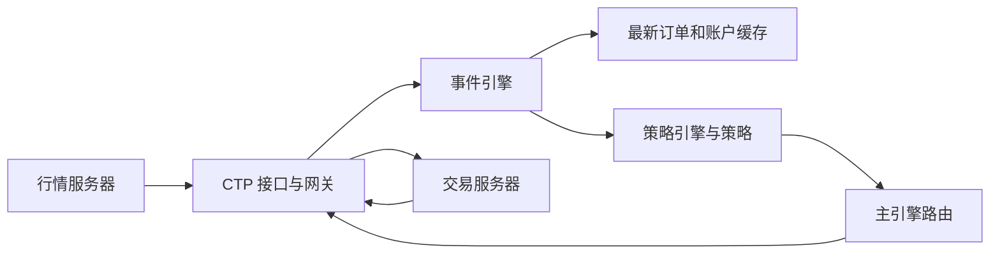

# 三个模块怎样一起工作

`vnpy` 提供标准对象和引擎；`vnpy_ctp` 对接外部服务器；`vnpy_ctastrategy` 承载策略。这是程序内不同职责，不是三个必须分别打开的 App。

上图描述框架路线。老师的最小 Demo 从底层 API 开始，先只实现连接和回调，不需要一次搭完图中每一层。

| 老师的概念 | 在已读源码中的位置 | 它解决的问题 |
|---|---|---|
| 数据结构标准化 | TickData、OrderData、TradeData | 策略不用到处处理柜台字段名 |
| 业务流程标准化 | BaseGateway 约定与 CtpGateway 实现 | 以统一方式连接、订阅、发单、接收回报 |
| 消息总线 | EventEngine | 一份行情可以交给多个处理模块 |
| OMS 缓存 | OmsEngine | 查询目前知道的最新状态 |
| 交易指令路由 | MainEngine.send_order | 找到目标网关发送请求 |
| 策略应用 | CtaEngine 与 CtaTemplate | 把行情送给正确策略、把成交归属到策略 |

## 从底层到策略的一次实际调用

以本作业的黄金行情为例：CTP 的 `onRtnDepthMarketData` 回调收到柜台字段；网关把它翻译成 `TickData`，再通过 `BaseGateway.on_tick` 放进事件总线。`OmsEngine` 留存最新行情，策略引擎按 `vt_symbol` 把事件交给策略。策略产生 `OrderRequest` 后，`MainEngine.send_order` 根据 `gateway_name` 选择网关；CTP 网关再把标准请求翻译回 CTP 报单字段。后来收到的 `OrderData` 表示委托状态，`TradeData` 才表示成交。我们写的底层 `MdApi`/`TdApi` Demo 直接完成其中部分工作，因此需要自己处理状态、缓存和风控。

底层的**数据标准化**让不同柜台的字段进入相同的 `TickData`、`OrderData` 等对象；**流程标准化**让网关都提供连接、订阅、发单、撤单等入口。中层 `EventEngine` 负责分发，`OmsEngine` 保存最近状态，`MainEngine` 把请求送到指定网关。这些层提供机制，不能替策略保证风控或盈利。[标准对象](https://github.com/vnpy/vnpy/blob/fa5206fe63836f3f8cd1ebd7168fbd19a5e2ff09/vnpy/trader/object.py#L1) · [网关入口](https://github.com/vnpy/vnpy/blob/fa5206fe63836f3f8cd1ebd7168fbd19a5e2ff09/vnpy/trader/gateway.py#L33) · [主引擎与 OMS](https://github.com/vnpy/vnpy/blob/fa5206fe63836f3f8cd1ebd7168fbd19a5e2ff09/vnpy/trader/engine.py#L81)。

## 三种策略应用

| 应用 | 主要输入和决策 | 关键执行问题 | 已读源码 |
|---|---|---|---|
| 单标的 CTA | 一只合约的 Tick/Bar；例如黄金短均线上穿长均线 | 该合约的信号、委托、止损和持仓状态 | [CtaEngine](https://github.com/vnpy/vnpy_ctastrategy/blob/6ef76981624bf55b2ea978f8587f74d633aafc72/vnpy_ctastrategy/engine.py#L69)、[CtaTemplate](https://github.com/vnpy/vnpy_ctastrategy/blob/6ef76981624bf55b2ea978f8587f74d633aafc72/vnpy_ctastrategy/template.py#L12) |
| 多标的投组 | 多只合约的同步 Bar；例如黄金目标 +1 手、白银目标 0 手 | 各合约实际仓位与目标仓位之差，分别下单和归属回报 | [StrategyEngine](https://github.com/vnpy/vnpy_portfoliostrategy/blob/164d94f35e75c1b3c5c9a62f0b94de78e3e9662c/vnpy_portfoliostrategy/engine.py#L51)、[rebalance_portfolio](https://github.com/vnpy/vnpy_portfoliostrategy/blob/164d94f35e75c1b3c5c9a62f0b94de78e3e9662c/vnpy_portfoliostrategy/template.py#L190) |
| 价差交易 | 两条或多条腿组成的价差盘口及价差持仓；例如买 A 卖 B | 先成交一条腿后，另一条腿未成交的敞口如何追补 | [SpreadData](https://github.com/vnpy/vnpy_spreadtrading/blob/5919a8ac06dce5a27ad485aaeef364e451e67dce/vnpy_spreadtrading/base.py#L136)、[SpreadTakerAlgo](https://github.com/vnpy/vnpy_spreadtrading/blob/5919a8ac06dce5a27ad485aaeef364e451e67dce/vnpy_spreadtrading/algo.py#L21) |

投组模板把 `vt_symbols`、`pos_data` 和 `target_data` 分别按合约保存，`rebalance_portfolio` 按仓差决定平仓或开仓。价差模块分 `SpreadDataEngine`（腿行情/价差数据）、`SpreadAlgoEngine`（多腿委托执行）、`SpreadStrategyEngine`（策略规则）；`SpreadTakerAlgo` 先处理主动腿，再追补被动腿。价差理论值满足条件不意味着两腿能同时成交，这就是它比单标的 CTA 多出的执行风险。这两套源码已阅读相关入口，**本作业没有安装或实盘运行这些应用**。

源码入口：[BaseGateway.on_tick](https://github.com/vnpy/vnpy/blob/fa5206fe63836f3f8cd1ebd7168fbd19a5e2ff09/vnpy/trader/gateway.py#L93)、[MainEngine.send_order](https://github.com/vnpy/vnpy/blob/fa5206fe63836f3f8cd1ebd7168fbd19a5e2ff09/vnpy/trader/engine.py#L254)、[CtaEngine.process_tick_event](https://github.com/vnpy/vnpy_ctastrategy/blob/6ef76981624bf55b2ea978f8587f74d633aafc72/vnpy_ctastrategy/engine.py#L147)。

继续阅读：[事件与数据](events-and-data.md)、[连接生命周期](ctp-lifecycle.md)。
